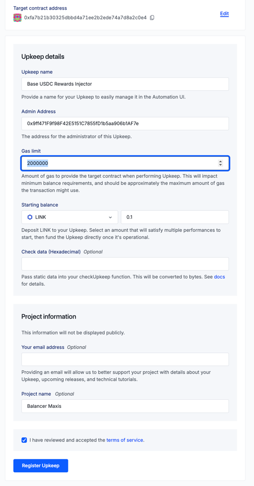
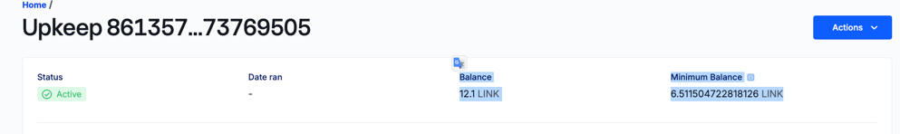

## Child Chain Gauge Injector V2

The ChildChainGaugeInjectorV2 was built to encapsulate over a year of learnings that came from operating Injector V1 in
the wild. The primary goal of this contract is to provide a more flexible and robust system for scheduling a steady
stream of single token rewards to ChildChainGauges.

The contract is designed to be a distributor for the ChildChainGauge, and has functionality to return distributorship to
the owner. The owner is also able to sweep all funds.

In such, this contract is not at all intended to be an onchain promise, but more of a way to automate the distribution
of rewards to the ChildChainGauge. The contract is designed to be operated by a Chainlink Keeper, and the owner is able
to add new schedules without implicating the already running schedules for a gauge. It can easily be used with other
keepers that adapt to the chainlink interface.

The primary changes in this contract from V1 are:

- Modular configuration, the owner can adjust 1 schedule at a time instead of always overwriting the whole list.
- More safeguards to enable the owner to prevent accidental scheduling mistakes therefore overspending budgets in the
  injector.
    - maxInjectionAmount: Don't inject more than this in a single tx ever.
    - maxInjectionAmountPerPeriod: Do not allow schedule changes that would lead the sum of all active schedules for one
      period to exceed this amount.
    - maxTotalDue: Do not allow schedule changes that would lead the sum of all active schedules for all remaining
      periods to exceed this amount.

### The Child Chain Gauge runs on weekly epochs:

- Only the defined distributor for a given token may start a 1 week stream of rewards by calling deposit_rewards() on the guage.
    - Any tokens transfered directly to the gauge will be lost, only add via a contract call.
    - Calling deposit rewards will kick off a 1 week stream of rewards, including whatever is added + any scheduled rewards not yet streamed.
- If a deposit_rewards is called during a currently running program, a new 1 week program will start, including the new amount + the portion of the rewards that have not yet been paid in.
- The injector uses changes to period_finish on the gauge contract to understand epochs and runs once per epoch as early as possible.
    - period_finish is part of the balancer/curve gauge contract, and describes when the current streaming rewards for a given token will end.  Deeper study of the gauge contracts are required to fully understand the function of this helper.
- The injector uses changes to period_finish on the gauge contract to understand epochs and runs once per epoch as early as possible, assuming the objective to maintain a steady stream of rewards.
- The injector is intended to be used with chainlink automation to pay gas/execute at the proper time. 

This contract is intended to operate as the distributor, and has functionality to return distributorship to the owner

## Deploying an injector using the factory

Go to the factory contract on the chain you need on etherscan, and call createInjector with the following parameters:

| Parameter            | Description                                                                                                                                                                                       |
|----------------------|---------------------------------------------------------------------------------------------------------------------------------------------------------------------------------------------------|
| keeperAddress[]      | A list of addresses that can trigger a due injection.  To start perhaps add your EOA, can include zero address in list to allow anyone to upkeep.                                                 |
| minWaitPeriodSeconds | A gauge should only be ready every 7 days.  This is a safeguard against something that should never happen, by default set to 6 days or 518400                                                    |
| injectTokenAddress   | An Injector runs on a single token.  Specify which one here.  For multiple tokens use multiple injectors                                                                                          |
| maxInjectionAmount   | The maximum amount of tokens that can be injected in a single transaction. Set it to something sane for your token/budget. Amount must be greater than 0. This is to prevent catostrophic scehduling mistakes |
| owner                | The owner of the injector.  This address can add and remove schedules, and sweep tokens.  Can be changed, if you're not sure set to your EOA.                                                     |

## Configuring the global settings of the injector

All the settings above can be changed above by clearly marked setter functions in the contract.

In addition, there are setters for the following global settings, which default to 0 (which means no limit). Note that
the limits below, which apply when setting schedules only will not be respected if a limit lowered, but the schedules
already in place violates it:

| Parameter                | Description                                                                                                                            |
|--------------------------|----------------------------------------------------------------------------------------------------------------------------------------|
| MaxGlobalAmountPerPeriod | A new program will not allowed to be added, if it would increase the total amount spent of all active programs in the a single period. |
| MaxTotalDue              | A new program will not allowed to be added, if it would increase the total amount spent of all active programs in all periods.         |

## Programming the Injector

The injector is intended to be used on Balancer gauges that already have a reward token configured with the injector set
as distributor. The Balancer Maxis can help you configure this.

The injector supports adding/overwriting one or more programs to the schedule at a time using add recipients:

| Parameter                 | Description                                                                                                                                                                                                                                                              |
|---------------------------|--------------------------------------------------------------------------------------------------------------------------------------------------------------------------------------------------------------------------------------------------------------------------|
| recipients                | A list of gauges that should be added or overwritten each with these settings.  Note that if a gauge already has a program in scheduled in this injector, it will be overwritten. The new program will run for the total number of rounds specified in maxPeriods below. |
| amountPerPeriod           | The amount of tokens that should be injected to the gauge each period. Note that if the injector already has a schedule from one of the listed gauges, it will be overwritten.                                                                                           |
| maxPeriods                | The number of periods that the program should run.                                                                                                                                                                                                                       |
| doNotStartBeforeTimestamp | The earliest time that the program should start.  The injector will only fire when it is able to, and there is no currently streaming rewards of that token on the gauge                                                                                                 |

removeRecipients can be called with a list of recipients to remove their schedules from the injector and abort any
furture scheduled payments.

## What else

There are good comments, and most of the other functions are pretty self explanitory.

## Setting up a chainlink automation (Balancer Maxi specific notes)
Each launched injector needs a chainlink automation instance that can trigger injections.  Here are instructions for setting this up, specifically for the Balancer Maxis.

0. Use the factory to launch a new injector, note its address, and get at least 0.1 LINK in your deployer wallet on the chain the upkeep is on.
1. Go to automation.chain.link and connect with a deployer connect to the correct chain.
2. Click register new upkeep.
   - Choose Custom Logic
   - Paste the address of the injector in `Target contract address`
   - Fill out the form linke below.  Note that for maxi management admin address should be omnichain safe (0x9ff), and that a gas limit of 2 million on L2s and 1 million on L1s is probably a good start point. 
   - 
   - Sign and execute the [transaction](https://basescan.org/tx/0x94b25b97c145c29906dfe531d810bc2cabf4881c69c87fb905e4ebe62758e6cd).
   - Sometimes chainlink UI flakes out on the add, once the transaction has executed everything is fine to continue.
3.  Connect to automation.chain.link with the omnichain multisig and connect to the chain.  Find your [upkeep](https://automation.chain.link/base/86135768442201151504182158474728964311183239902024293588082768088596173769505) based on it's name and target address.
4. Note the forward address for your upkeep.  This must be [added to the injector as a keeper](https://basescan.org/tx/0x607211f9e8c79b4500f42a0eb9c5b80c9ff622f331951023e7a1b30dcd1b57e9) unless the 0 address is present to allow anyone to keep.
5. Also ensure that the upkeep is funded with well more link than required for 1 upkeep.  Note the amount required can be lowered by better tuning the gas limit.  You can pay in more link from any address by selection Actions -> Fund Upkeep.
    - There should be Link in the omnichain safe on many chains.  If not, buy extra and send it there.
6. The upkeep should now be running/ready to go.  Ensure that the forwarder can performUpkeep on the injector, and that there is enough LINK for the next run.

